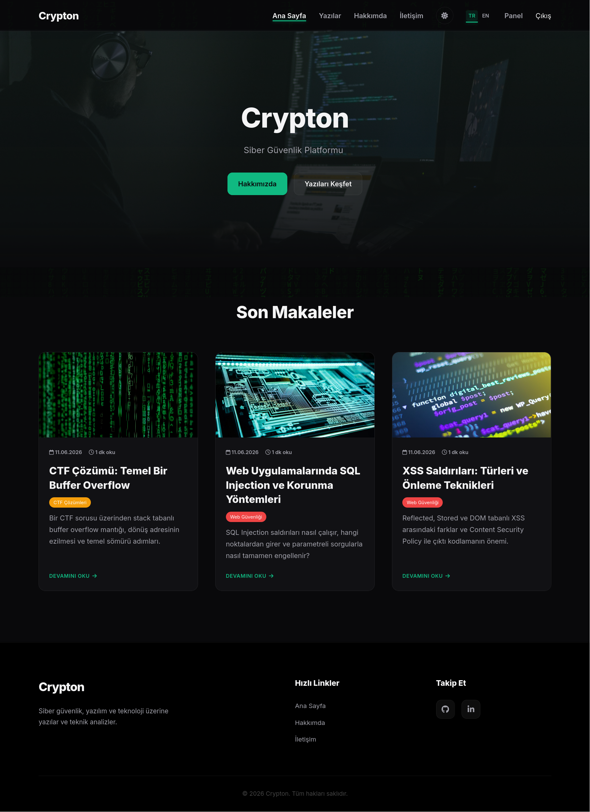
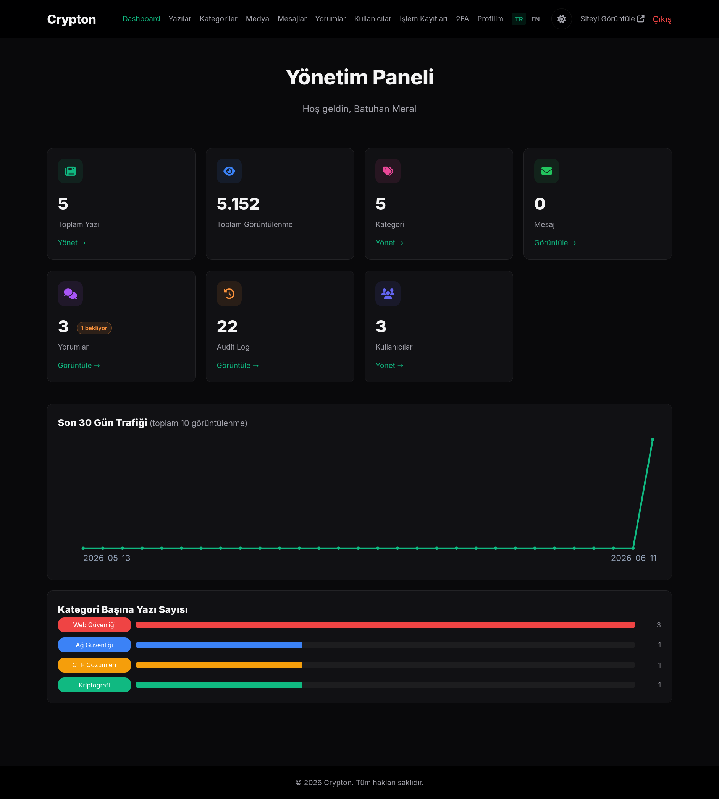
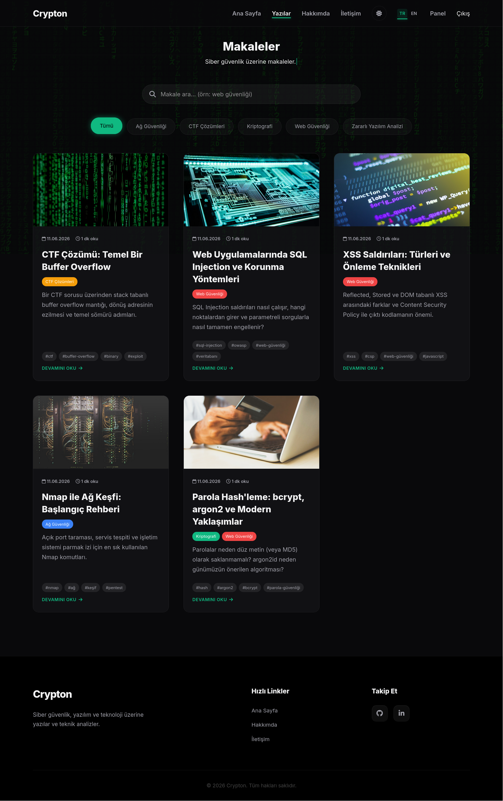

# Crypton

> A hardened, server-rendered cybersecurity blog with a secret-path admin panel, RBAC, 2FA, and full TR/EN internationalization.

Crypton is a personal **cybersecurity blog** for publishing articles, technical write-ups, and analyses on topics like web security, network security, malware, and CTF challenges. Readers get a fast, clean reading experience, while you manage everything — posts, categories, media, and comments — from a private admin panel. Security is built in from the ground up, so your blog stays locked down without extra setup.

## 🚀 Features

- **Write & publish**: a Markdown editor with categories, tags, cover images, and a built-in media library.
- **Search & browse**: fast full-text search with dedicated tag and category pages.
- **Team roles**: admin, editor, and author accounts — everyone sees and manages only what they're allowed to.
- **Two-factor login (2FA)**: optional extra security with an authenticator app and backup codes.
- **Secure by default**: nonce-based CSP, CSRF protection, rate-limited logins, spam-resistant forms, and sanitized user content.
- **Dark & light theme**: one-click theme switch that's remembered across visits.
- **Bilingual (TR / EN)**: switch the whole site and admin panel between Turkish and English instantly.
- **SEO ready**: clean meta tags, shareable link previews, an RSS feed, and a sitemap.
- **Insights**: a traffic dashboard, post view counts, and an activity log.
- **Pleasant reading**: table of contents, reading-progress bar, code highlighting, related posts, and comments.

## 🛠️ Tech Stack

| Layer | Technologies |
| --- | --- |
| **Backend** | Node.js (≥18), Express 4 |
| **Frontend** | EJS server-side templates, vanilla JS, custom CSS (dark theme) |
| **Database** | MongoDB with Mongoose 8 (`connect-mongo` session store) |
| **Security** | argon2 / bcrypt, Helmet (CSP), speakeasy (TOTP), express-rate-limit, sanitize-html, express-validator |
| **Media & Content** | sharp (image processing), multer (uploads), marked (Markdown), EasyMDE |
| **Tooling / DevOps** | Docker, Docker Compose, pino (logging), nodemon |

## 📦 Installation

### Prerequisites

- Node.js ≥ 18
- MongoDB (local instance) — or use the bundled Docker setup
- Docker & Docker Compose (optional, recommended)

### 1. Clone & install

```bash
git clone https://github.com/batuhanmeral/Crypton.git
cd crypton
npm install
```

### 2. Configure environment

Copy the example file and fill in your values:

```bash
cp .env.example .env
```

```env
# Application
NODE_ENV=development
PORT=3000
HOST=0.0.0.0

# Database
MONGODB_URI=mongodb://localhost:27017/crypton

# Session — REQUIRED in production (process exits if left default)
SESSION_SECRET=a-long-random-hard-to-guess-string

# Trust reverse-proxy headers (X-Forwarded-*) so req.ip is the real client IP.
# Number of hops, "true"/"false", or blank (defaults to 1 in production, off otherwise).
# Set this when running behind Nginx / a load balancer so rate limits and IP hashes are accurate.
TRUST_PROXY=1

# Hide the admin login behind a secret slug -> /admin/<slug>
ADMIN_LOGIN_PATH=secret-entry

# Optional: persistent uploads directory ($DATA_PATH/uploads)
DATA_PATH=/var/data

# Public site URL (RSS / sitemap / canonical / Open Graph)
SITE_URL=https://your-domain.com

# 2FA issuer label shown in authenticator apps
TOTP_ISSUER=Crypton
```

### 3. Run

```bash
npm run dev     # development (nodemon, :3000)
npm start       # production (NODE_ENV=production)
```

### Run with Docker (app + MongoDB)

```bash
docker compose up -d --build
```

Compose provisions MongoDB 7 with a healthcheck and persistent volumes (`mongo-data`, `uploads`), and overrides `MONGODB_URI` so the app reaches the `mongo` service on the compose network.

## 💡 Usage

### Create the first admin

On a fresh database, bootstrap an admin account (run it again with the same username to reset the password):

```bash
npm run create-admin -- <username> <password>

# inside Docker:
docker compose exec app npm run create-admin -- <username> <password>
```

Then sign in to the admin panel at the secret path you set in `ADMIN_LOGIN_PATH`:

```text
http://localhost:3000/admin/secret-entry
```

> Additional users are created from the admin panel (**Users** section), which is restricted to the `admin` role. Each role sees only the panels it is allowed to use.

### Common operations

```bash
npm run create-admin -- <user> <pass>  # Create (or reset the password of) an admin account
npm run migrate:roles                  # Backfill roles / password algo / post ownership
```

### Public routes

| Route | Description |
| --- | --- |
| `GET /` | Home (latest posts) |
| `GET /blog?q=<term>` | Full-text search |
| `GET /tag/:tag` · `GET /category/:slug` | Filtered lists |
| `GET /blog/:id` | Post detail |
| `POST /blog/:id/comments` | Submit a comment (rate-limited, moderated) |
| `GET /rss.xml` · `/sitemap.xml` · `/robots.txt` | SEO endpoints |

### Roles & permissions

| Capability | admin | editor | author |
| --- | :---: | :---: | :---: |
| Manage own posts / media | ✓ | ✓ | ✓ |
| Manage **all** posts / media | ✓ | ✓ | — |
| Categories & contact messages | ✓ | ✓ | — |
| Users & audit log | ✓ | — | — |

## 📸 Screenshots

| Home | Dashboard | Articles |
| :---: | :---: | :---: |
|  |  |  |

## 📄 License

Released under the [MIT License](LICENSE). © 2026 Batuhan Meral.
